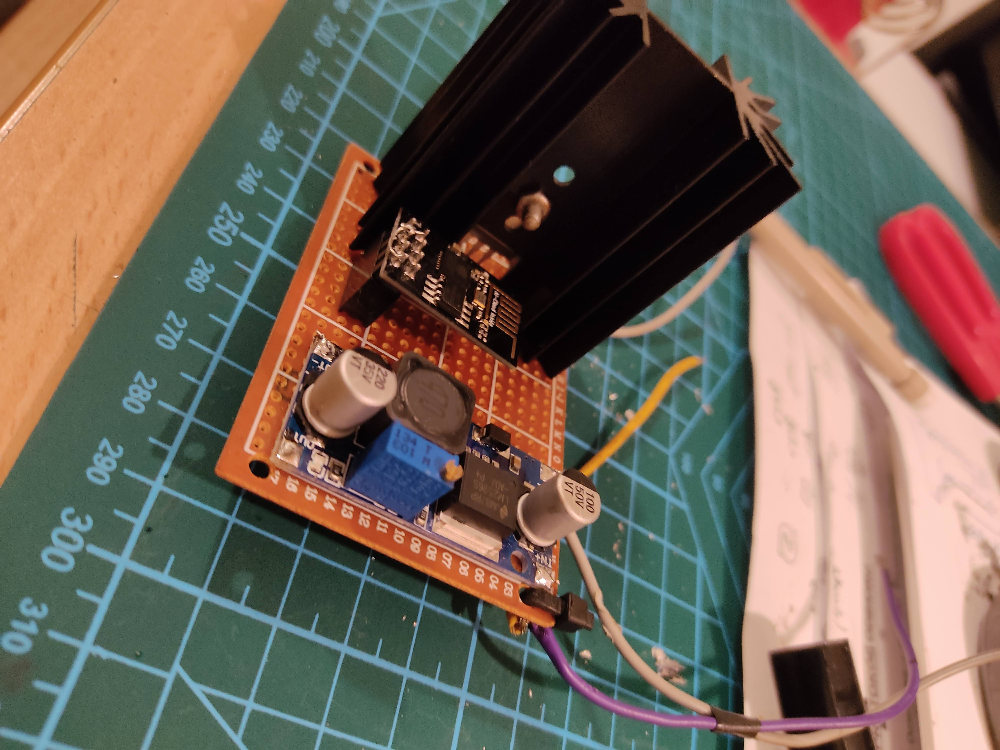

# LightDimmerTV
Esp01 dimmer  
TV Dimmer is ESP8266 ceiling led driver. It dims the LEDs when tv is on (checking its IP if it responds)  
pin 2 is connected to stp16nf06l MOSFET.  
## Screenshot  
 
